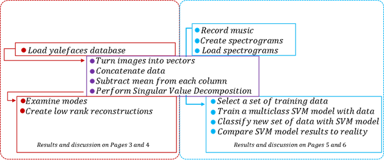
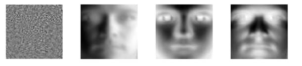
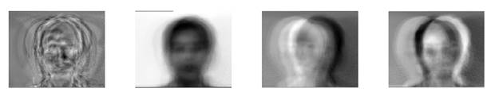
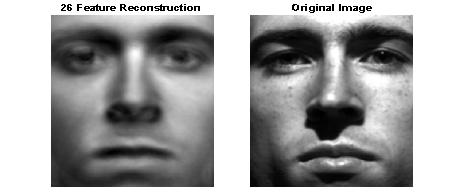
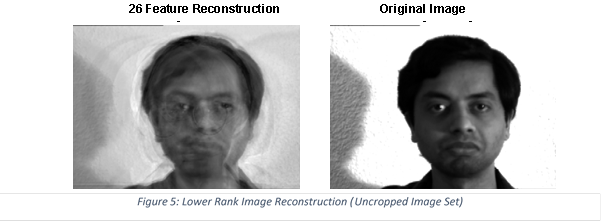
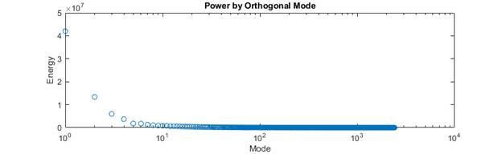
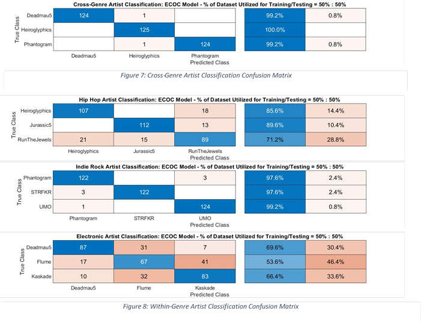
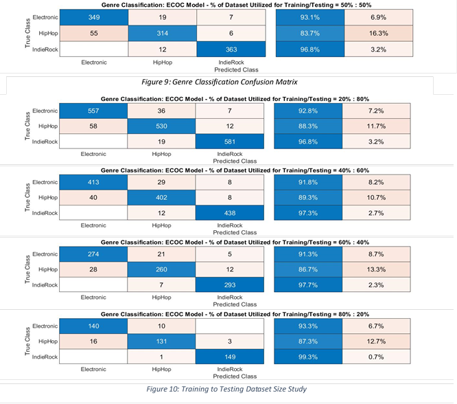

<body lang=EN-US link=blue vlink="#954F72">

<h1 style='margin-top:0in;margin-right:0in;margin-bottom:0in;margin-left:2.0in;
margin-bottom:.0001pt;text-indent:.5in;line-height:115%'>Nicolette Lewis</h1>

<h1 style='margin-top:0in;line-height:115%'> March 10, 2020 </h1>

<h2>Abstract</h2>

The Singular Value
Decomposition is a powerful tool in Linear Algebra which uses diagonalization
techniques upon sets of data to determine power scaling of the primary features
of the data. In this study, the SVD was performed on sets of vectorized images,
and the results of the SVD were analyzed in various ways. The first set of
images was a cropped set of centered portraits, each of which represented a person
or the same person with varying degrees of noise. The second set of images was
an uncropped version of the first set of portraits, where face locations varied
from frame to frame. A SVD was performed on the first and second data sets and
the effect of image centering/normalization on SVD resolution of primary
orthogonal features was examined. The third set of data was acquired from
performing spectral analysis on 3 hours of music, producing spectrograms of 5
second clips from 9 musical artists, with 3 musical genres represented (Hip Hop,
Electronic, and Indie Rock). The spectrograms were vectorized, assembled into
an array, and a Singular Value the data. A multiclass ECOC model (a binary
classification algorithm utilizing Matlab’s SVM package) was used to classify
new segments of the artists and genres learned upon for various cases. Results
from this analysis can be found in Section IV, Computational Results.

&nbsp;

<h2>Sec. I. Introduction and Overview </h2>

We first examine the
output from the SVD upon the set of data representing the cropped images of
faces obtained from the YaleFaces database, and the quality of low rank
reconstruction that the decomposed modes are capable of. SVD modes and modal participations
of the vectorized uncropped image set are compared to those of the cropped
image set, and the effects of data position and alignment upon the resolution
of the features of interest with the SVD are examined. Using the principles learned from the SVD and low rank
reconstructions of the first two datasets, the third dataset was analyzed to examine
principle features that were distinguishable between observations. This dataset
was comprised of vectorized sets of spectrograms of song segments from 180
minutes of music, covering 9 artists and 3 genres of music. A training set was
selected randomly from within this third dataset. Principle features and
participations of the observations within the training set were documented and
a multiclass support vector machine learning algorithm was trained upon the
documented features and participations. With this model trained to classify
based on principle features/participation, new observations were classified and
the classes to which they belong were checked against known classifiers of the
data. This analysis was completed on three sets of spectrogram data, the first
containing artists of different genres, with the intent of distinguishing which
artist the test samples were drawn from. The second spectrogram set contained artists
of a single genre, with the intent of training the model to distinguish which artists
within the genre that each test samples were drawn from. The third was comprised
of three genres of music, with the intent of training a model to distinguish which
genre test samples belong to. Effect of ratio of size of training set upon test
set classification was examined for all cases. Results of this analysis, as
well as previously mentioned exercises are available in Section IV. The
datasets utilized and the implementation code are available online at <a
href="https://github.com/nsaoirse/ImageReconstruction-MusicClassification_SVD-fitcecoc">https://github.com/nsaoirse/ImageReconstruction-MusicClassification_SVD-fitcecoc</a>.

<h2>Sec. II Theoretical Background </h2>

The
Singular Value Decomposition, or SVD, is an incredibly powerful tool in linear
algebra which can be used to examine the principle dynamics of data. The
technique uses an expansion of the data into two bases to represent said data
in diagonalized form, with principle components and energies recorded to allow
for reconstruction of the data in a lower rank. According to Kutz, in Data
Driven Modelling and Scientific Computing , for any set of data , “the
SVD makes it possible for every matrix to be diagonal if the proper bases for
the domain and range are used… consider that since U and V are orthonormal
bases inand respectively,
then any vector in these spaces can be expanded in their bases.”  In short,
what this means is that any matrix can be diagonalized with the Singular Value
Decomposition, as the method is not contingent on positive definiteness or
symmetry of the matrix. The SVD of something is guaranteed to exist; but the
SVD doesn’t necessarily guarantee that all dynamics within the system will be
captured. Careful inspection of the modal decomposition of the data and
energies associated with the proper orthogonal modes sheds light on the primary
dynamics and hidden dynamic behavior. The multiple bases utilized in the SVD
allow for decomposition of a symmetrized form of the data matrix, . By
examining the singular values and the principle components and contributions of
each principle component to the features of the data analyzed, we can make
inferences about the driving dynamics of the data and interpret the effects of
interactions between components of the data. 

                Using the results from
the principle component analysis of datasets, we can train statistical classification
models to interpret and distinguish (from primary features extracted from new
data) which of the trained classes any new data ought to belong to. This can be
done via a method which involves taking data, transforming it into a coordinate
system where it can be sorted by some clustering algorithm, and discretizing
the dataset via dissection of the parameter space within the coordinate system chosen.
 In this case, an Error-Correcting Output Code model (fitcecoc function) from MATLAB’s
SVM toolset was used, which uses one-versus-one discriminant analysis methods
to distinguish between classes. According to Furnkranz, the ECOC model works by “encoding
a c-class problem as binary
problems (&gt;c),
where each binary problem uses a subset of the classes as the positive class
and the remaining classes as a negative class….. New examples are classified by
determining the row in the matrix that is closest to the binary vector obtained
by submitting the example to the classifiers.”

The quality of the classification
algorithm output is highly contingent on the volume and quality of the training
set utilized, with more training data corresponding to a higher rate of
positive classification. The behavior of this phenomenon is investigated in detail
in Section IV.

<h2>Sec. III. Algorithm Implementation and Development </h2>

                

<b>Image Reconstruction Algorithm                                              Music
Classification Algorithm</b>

      

The algorithm used for this analysis can be described
diagrammatically by Figure 1. The analysis proceeds as follows for the Image
Reconstruction portion of this study; images were first loaded into MATLAB from
the database. These images were then transformed into vectors, and all images
were stored in an array with columns representing the vectorized images. A
singular value decomposition was performed on this array, extracting the
primary features common amongst all images. These primary features and their powers
were plotted and investigated. A single image was chosen randomly to be
reconstructed from the decomposed modes, powers, and participations. The
maximum participation of the features was sorted by index, and the features and
their corresponding powers and participations were projected back to the
original coordinate system to create low rank approximations of the images from
small amounts of features. This process was repeated on hundreds of random
images to verify that the algorithm worked properly, and it seemingly did, producing
relatively accurate reconstructions of the faces of interest. The algorithm
developed upon the cropped faces then was performed on the uncropped faces, and
the differences between the two datasets and their SVD were examined. 

                For
the Music Classification portion of this assignment, the same operations were
performed upon images of spectrogram data, but low rank approximations were not
produced for the data. Instead, the output from the Singular Value
Decomposition upon the full dataset of spectrograms was partitioned randomly,
creating training and test sets of data for a SVM model to perform Multiclass
Classification upon. The effect of various ratios of size of training set to
testing set upon algorithm classification accuracy were examined, and the
efficacy of the algorithm in sorting various types of song datasets (within-genre
Artist classification, cross-genre Artist classification, and genre classification)
was investigated. Results can be found in the following section, Computational
Results.

<h2>Sec. IV. Computational Results – Part 1</h2>

<h3>            Image Reconstruction</h3>

Figure 2: Most Powerful Modes for Random Given Image
Reconstruction (Cropped Image Set)

Figure 3:Most Powerful Modes for Random Given Image
Reconstruction (Uncropped Image Set)

 Figure 4: Lower Rank Image
Reconstruction (Cropped Image Set)

The first 4 primary modes of the SVD on the
cropped YaleFaces database can be seen in Figure 2. For each face that is
reconstructed, the primary mode is typically related to the details within the
face of interest which would allow for resolution of details pertaining to the
particular face being reconstructed. With low rank approximations of the images
reconstructed, the error between original images and their low rank approximations
was calculated for varying ranks of approximation. The error decreases rapidly
with addition of number of modes up until roughly 10 modes are used to approximate
the “face space” of the modes. The second data set is comprised of the same images
as that of the first, without cropping and centering of the faces. The SVD does
a poor job of resolving the primary features within the set of images,
resulting in modes that are associated with the varying position of the faces
within the dataset. Primary features from the SVD performed on the uncropped image
dataset can be seen in Figure 3.

The
orthogonal modes of the array X containing the vectors which represent the
cropped images of the yalefaces database are themselves the main features
representing each face within the database. Nuanced features of each face are
reconstructed to some degree from similar faces within the database containing
stronger features where weaker features within the face being reconstructed failed
to be captured by the POD. Sigma represents the number of faces required to
achieve the best available reconstruction of the face from the decomposed
primary features of the images analyzed. 

The
rank returned by MATLAB's rank function is 240, which is the number of observations.
This is either due to noisy images included in the dataset, or the features of
each image being distinct enough that each variation within the images is great
enough to constitute a mode representing those variations. By looking at the
modes generated by the SVD, it is evident that noise and intensity gradients
are themselves represented by modes of lower powers (represented by the
magnitude of the associated sigmas). By looking at the full array of sigma
values, it is clear that there are 5 dominant sigma values associated with the first
5 decomposed modes, however, it can take 25 or more modes to adequately resolve
someone’s face such that it is recognizable from the original image. This is roughly
1% of all features for the cropped image dataset, and 15% of the uncropped image
dataset features. This is demonstrated in Figures 4 and 5 for the cropped and
uncropped datasets respectively. The modes are effectively arranged by the SVD
from most dominantly resolved features to least resolved features. 

V is the modal
participation of the primary orthogonal modes (U) to the degree of freedom or
column of data that is associated with the row of X (the observation) to which
V's contributions project modes U with scaling factors S. S represents the
variances in pixel intensity between the images of the people assembled within
the dataset, which effectively tells us how similar the pictures of people are
to each other, or how much that image is represented by the other. This S array
is what allows redundant data and overdetermined systems to be reduced to the
primary dynamics for analysis. In this case our primary system dynamics are the
features that are similar between the images processed. For the cropped case (Figure
2, Figure 4) the SVD does a great job of extracting similar features within the
images. This is because the vectorized images have similar trends in pixel
intensity, and there is little offset of the peaks and troughs in the data due
to the alignment of the images within pixel space. 

With the uncropped
scenario, (Figure 3, Figure 5) the SVD has a difficult time extracting facial
features, as the faces are not aligned, and facial features are not the most
common regions of variation in the data. What not centering the faces is
essentially doing is shifting the intensity variations around in the vectorized
images. Performing an SVD on this will distinguish not the slight variations in
pixel intensity at the same locations, but what the SVD does is try to extract
the primary distinguishing variations in pixel intensity. This results in a
sort of blurring of the features and a poor reconstruction of the images
without relatively high amounts of features. Reconstruction of the images from
the primary modes makes this immediately evident. For both the cropped and
uncropped situation, the number of modes requires to reconstruct faces to an
acceptable degree is roughly 25. 

<h2>Sec. IV. Computational Results – Part 2</h2>

<h3>            Music Classification </h3>

Results from the investigations of robustness of MATLAB’s SVM
fitcecoc and predict functions in identifying new samples of music from
principle component analysis and linear discriminant analysis are shown below
in Figures 7 through 10. The algorithm does a pretty good job at classifying
which Artist song samples belong to when the artists are selected from
different genres, with only a 0.5% misclassification rate. When artists belong to
the same genre, this algorithm has a more difficult time distinguishing the
artists, as primary features are more similar between songs within the same
genre (whether it is tempo, timbre of the instruments, or frequency of the
instruments/singing typically used in the songs, similarity in mathematical features
which describe the songs are often common between music within same narrow genres). 
While the algorithm did well with the selection of Indie artists, it performed only
fairly on selections of Hip Hop and poorly on selections of Electronic music in
distinguishing which artist within that genre the samples belong to (Figure 8).
The algorithm typically did well distinguishing which genre the songs belong
to, regardless of the size of the training and testing set (Figure 9). Improvements
were seen with larger and larger training sets, but growth in positive
identification of classifiers was relatively unsteady with respect to the growth
of the size of the training data.

<h3>
Confusion Matrices for MATLAB’s
fitcecoc Multiclass SVM model</h3>

 

&nbsp;

<h2> 
Sec. V. Summary and Conclusions </h2>

            This study examined the
effects of data alignment and resolution upon quality of SVD low rank
reconstructions, as well as the ability of MATLAB’s SVM toolset to learn from
datasets and use the trained SVM models to classify new sets of sample data.
Effects of dataset size and data nature upon positive classification from
primary feature decomposition was also investigated. As
the dynamics of the system become more complicated, or become nonlinear, the
POD of data can lose robustness, and fail to describe existing dynamics within
the data adequately. With more training data and a larger statistical dataset from
which SVM models can be trained, there is a positive correlation between size
of training set and positive classification of new datasets from primary features.
For access to the functions used in this study, as well as videos of the
analysis, visit <a
href="https://github.com/nsaoirse/ImageReconstruction-MusicClassification_SVD-fitcecoc">https://github.com/nsaoirse/ImageReconstruction-MusicClassification_SVD-fitcecoc</a>.

<h1><b>Appendix A - MATLAB functions used and brief implementation
explanation</b><b> </b></h1>

mean                                                     -
used to calculate the mean of each row of the data matrix, X

svd                                                          -
used to perform the singular value decomposition 

fitcecoc                                                  -
used to train a multiclass SVM model on the training dataset

predict                                                    -
used to classify new sets of data using trained SVM models

confusionchart                                     -
used to generate confusion matrices

&nbsp;

<b>References</b>

Fürnkranz, Johannes, “Round Robin
Classification.”&nbsp;<em>J. Mach.
Learn. Res.</em>, Vol. 2, 2002, pp. 721–747.

&nbsp;

<h1 style='margin-top:0in;line-height:normal'><b>Appendix B MATLAB codes</b></h1>

</body>

</html>

      ------------------------------------------------------------------------------------------------------------------------------------------------------------
      [1] – SortTheFaces.m
      ------------------------------------------------------------------------------------------------------------------------------------------------------------

      rootdir = 'C:\Users\nsaoirse\Desktop\Coursework\AMATH582\Homework4\drive-download-20200305T235418Z-001';
      listofthings = dir(fullfile(rootdir, '**\*.*'));  %get list of files and folders in any subfolder
      photos = listofthings(~[listofthings.isdir]);  %remove folders from list
      cropped=photos(endsWith({photos.name}, 'pgm'));
      uncropped=photos(endsWith({photos.name}, 'gif'));
      cd drive-download-20200305T235418Z-001 
      % cd CroppedYale
        cd yalefaces
      k=size(uncropped,1);
      p = randperm(k,k);
      faces=[];
      for i=1:k;
      face=(double(imread(uncropped(p(i),:).folder+"\"+uncropped(p(i),:).name)));
      % face=(double(imread(cropped(p(i),:).folder+"\"+cropped(p(i),:).name)));
      fcs=reshape(face,prod(size(face)),1);
      faces=[faces,fcs];
      % imshow(imread(cropped(p(i),:).folder+"\"+cropped(p(i),:).name))
      end
      pause
      ------------------------------------------------------------------------------------------------------------------------------------------------------------
      [2] – croppedYale.m
      ------------------------------------------------------------------------------------------------------------------------------------------------------------
      clear all
      % SortTheFaces
      load croppedfaces.mat
      k=size(faces,2);
      randface = randperm(k,1);
      X=faces; 
      DataRank=rank(X); % Computing rank
      [m,n]=size(X); % compute data size
      mn=mean(X,1); % compute mean for each column
      X=X-repmat(mn',1,size(X,1))'; % subtract mean from X
      [u,s,v]=svd(X/sqrt(n-1),'econ'); % perform the SVD
      semilogx(1:size(s,1),diag(s).^2,'o');
      xlabel('Mode')
      ylabel('Energy')
      title('Power by Orthogonal Mode')
      %% Lo-Rank
      nfeat=size(v,1);
      fct=200;
      figure(2)
      for f=1:size(v,2);
          [val ind] = sort(s(:,f),'descend');
          mainfeat(f,:)=ind(1:fct);
      end
      indd=mainfeat(randface,:);
      upl=u(:,indd);
      figure(2)
      for j=1:4;
          subplot(1,4,j)
          imshow(mat2gray(reshape(upl(:,j),192,168))); drawnow
      end
      for fct=1:fct;
          figure(3)
          subplot(3,4,[5,6,9,10]-[4,4,4,4])
          LoRank=u(:,indd(1:fct))*s(indd(1:fct),indd(1:fct))*v(:,indd(1:fct)).';
          imshow(mat2gray(reshape(LoRank(:,randface),192,168)))
          title(string(fct)+" Feature Image Reconstruction")
          subplot(3,4,[7,8,11,12]-[4,4,4,4])
          imshow(mat2gray(reshape(faces(:,randface),192,168)))
          title('Original Image')
          disp(string(fct)+" Mode Reconstruction Error")
          Error(fct)=sqrt((faces(:,randface)-LoRank(:,randface))' * (faces(:,randface)-LoRank(:,randface)))/norm(faces(:,randface))
          subplot(3,4,[9,10,11,12])
          semilogy(1:fct,Error,'o')
          xlabel('Number of Modes')
          ylabel('Percent Error')
          title(sprintf("Reconstruction Accuracy = %0.1f%", 100-Error))
      end

      ------------------------------------------------------------------------------------------------------------------------------------------------------------
      [3] – uncroppedYale.m
      ------------------------------------------------------------------------------------------------------------------------------------------------------------
      clc
      clear all
      close all

      % SortTheFaces
      load uncroppedfaces.mat
      k=size(faces,2);
      randface = randperm(k,1);
      X=faces;

      DataRank=rank(X); % Computing rank
      [m,n]=size(X); % compute data size
      mn=mean(X,1); % compute mean for each column
      X=X-repmat(mn',1,size(X,1))'; % subtract mean from X
      [u,s,v]=svd(X/sqrt(n-1),'econ'); % perform the SVD

      semilogx(1:size(s,1),diag(s).^2);
      xlabel('Mode')
      ylabel('Energy')
      title('Power by Orthogonal Mode')

      %% Lo-Rank
      nfeat=size(v,1);
      fct=26;
      figure(2)

      for f=1:size(v,2);
          [val ind] = sort(s(:,f),'descend');
          mainfeat(f,:)=ind(1:fct);
      end

      indd=mainfeat(randface,:);
      upl=u(:,indd);

      figure(2)
      for j=1:4;
          subplot(1,4,j)
      imshow(mat2gray(reshape(upl(:,j),243,320))); drawnow
      end

      for fct=1:fct;
          figure(3)
          subplot(3,4,[5,6,9,10]-[4,4,4,4]) 
          LoRank=u(:,indd(1:fct))*s(indd(1:fct),indd(1:fct))*v(:,indd(1:fct)).';
          imshow(mat2gray(reshape(LoRank(:,randface),243,320)))
          title(string(fct)+" Feature Image Reconstruction")
          subplot(3,4,[7,8,11,12]-[4,4,4,4])
          imshow(mat2gray(reshape(faces(:,randface),243,320)))
          title('Original Image')
          disp(string(fct)+" Mode Reconstruction Error")
          Error(fct)=immse(reshape(faces(:,randface),243,320),reshape(LoRank(:,randface),243,320));
          subplot(3,4,[9,10,11,12])
          semilogy(1:fct,Error,'o')
          xlabel('Number of Modes')
          ylabel('Mean Squared Error')
          title(sprintf("MSE = %0.1f%", Error))
      end
      ------------------------------------------------------------------------------------------------------------------------------------------------------------
      [4] – SpectrogramGeneration.m
      ------------------------------------------------------------------------------------------------------------------------------------------------------------
      clc
      clear all
      close all
      genre=3;
      if genre==1;
      rootdir = 'C:\Users\nsaoirse\Desktop\Coursework\AMATH582\Homework4\IndieRock\'
      elseif genre==2;
      rootdir = 'C:\Users\nsaoirse\Desktop\Coursework\AMATH582\Homework4\HipHop\'
      else;
      rootdir = 'C:\Users\nsaoirse\Desktop\Coursework\AMATH582\Homework4\Electronic\'
      end
      listofthings = dir(fullfile(rootdir, '**\*.*'));  %get list of files and folders in any subfolder
      songs = listofthings(~[listofthings.isdir]);  %remove folders from list
      tr_rec=5; % record time in seconds
      for i=1:size(songs,1);
          name=songs(i).name;
          folderOI=songs(i).folder;
      cd(string(folderOI))
      y=audioread(name); Fs=length(y)/tr_rec; 
      v = sum(y,2)'/2;
      nsamples=length(v);
      nbins=nsamples;
      t=(1:length(v))/Fs; % this is our T
      dt=t(2)-t(1);
      termtime=nsamples*dt;
      % number of increments
      gt2=linspace(0,max(t),nsamples+1); gt=gt2(1:nsamples); 
      df = Fs/nbins;
      k = (0:df:(Fs-df)) - (Fs-mod(nsamples,2)*df)/2; %<- stack exchange
      % gt=gt(1:end-1);1
      ks=fftshift(k);
      sffttot=[];
      increment=nsamples/128;
      gtslice=gt(1:increment*2:end); % undersampled
      sffttot=[];
      for gg=1:length(gtslice);
      sig=nbins/(8*increment);
      g=exp(-sig^2*(t-gtslice(gg)).^2); % gaussian
      wavename='Gaussian Window';
      sfft=fft(g.*v);
      sfftfilt=(sfft).*1;
      sffttot=[sffttot;abs(fftshift(sfft)/max(abs(sfft)))];
      end
      f=figure("Visible",false);
      pcolor(gtslice,k(end/2 : end),sffttot(:,end/2 : end)'); hold on
      shading interp
      colormap jet
      axis tight
      set(gca,'xtick',[])
      set(gca,'ytick',[])
      set(gca,'visible','off')
      set(gca,'YScale','log')
      axis([gtslice(1) gtslice(end) k(end/2 + 100) k(end/2 + 30000)])
      print(string(erase(name,'.mp3'))+".jpg",'-djpeg')
      close(f)
      cd ..
      end
      ------------------------------------------------------------------------------------------------------------------------------------------------------------
      [5] – MusicClassify.m
      ------------------------------------------------------------------------------------------------------------------------------------------------------------
      clc 
      clearvars -except Specs U S V BandLabels
      close all
      % VectorizingSpectrograms.m
       load AllSongdata.mat
      BandLabels(1:250,1) = repmat({'Deadmau5'},250,1);
      BandLabels(251:500,1) = repmat({'Flume'},250,1);
      BandLabels(501:750,1) = repmat({'Kaskade'},250,1);
      BandLabels(751:1000) = repmat({'Heiroglyphics'},250,1);
      BandLabels(1001:1250) = repmat({'RunTheJewels'},250,1);
      BandLabels(1251:1500) = repmat({'Jurassic5'},250,1);
      BandLabels(1501:1750) = repmat({'STRFKR'},250,1);
      BandLabels(1751:2000) = repmat({'Phantogram'},250,1);
      BandLabels(2001:2250) = repmat({'UMO'},250,1);
      GenreLabels(1:750,1) = repmat({'Electronic'},750,1);
      GenreLabels(751:1500,1) = repmat({'HipHop'},750,1);
      GenreLabels(1501:2250,1) = repmat({'IndieRock'},750,1);
      ratio=0.6;
      k=250;
      nrand=k*ratio;
      ntest=k-nrand;
      randSong = randperm(k,nrand);
      testSong = setdiff(1:250,randSong);

      kg=750;
      nrandg=kg*ratio;
      ntestg=kg-nrandg;
      randGen = randperm(kg,nrandg);
      testGen = setdiff(1:750,randGen);

      SetDataLim
      randElec=randGen;
      testElec=setdiff(1:750,randElec);
      randHipHop=750+randGen;
      testHipHop=setdiff(751:1500,randHipHop);
      randIndie=1500+randGen;
      testIndie=setdiff(1501:2250,randIndie);
      Genres={'Electronic','HipHop','IndieRock'};
      Electronic={'Deadmau5','Flume','Kaskade'};
      HipHop={'Heiroglyphics','RunTheJewels','Jurassic5'};
      IndieRock={'STRFKR','Phantogram','UMO'};

      [U,S,V]=svd(Specs-(mean(Specs,1).*ones(size(Specs,1),1)),'econ');
      % 
      % % case 1
      % Bands={'Deadmau5','Heiroglyphics','Phantogram'}; %% case 1
      % Labels = BandLabels([randDm5,randHeiro,randPhant]);
      % X=(V(:,[randDm5,randHeiro,randPhant]).^(1/8))';
      % test=(V(:,[testDm5,testHeiro,testPhant]).^(1/8))';
      % Reality=BandLabels([testDm5,testHeiro,testPhant]);
      % figtitl='Artists of Different Genres';
      % testU=(U(:,[testDm5,testHeiro,testPhant]).^(2))';
      % testS=(S([testDm5,testHeiro,testPhant],[testDm5,testHeiro,testPhant]).^(2))';
      % trnS=(S([randDm5,randHeiro,randPhant],[randDm5,randHeiro,randPhant]).^(2))';

      % % case 2 a
      % Bands=HipHop; %% case 2
      % Labels = BandLabels([randHeiro,randRTJ,randJ5]);
      % X=(V(:,[randHeiro,randRTJ,randJ5]).^(1/5))';
      % test=(V(:,[testHeiro,testRTJ,testJ5]).^(1/5))';
      % Reality=BandLabels([testHeiro,testRTJ,testJ5]);
      % figtitl='HipHop Artists';
      % testU=(U(:,[testHeiro,testRTJ,testJ5]).^(2))';
      % testS=(S([testHeiro,testRTJ,testJ5],[testHeiro,testRTJ,testJ5]).^(2))';
      % trnS=(S([randHeiro,randRTJ,randJ5],[randHeiro,randRTJ,randJ5]).^(2))';

      % % case 2 b
      % Bands=Electronic; %% case 2
      % Labels = BandLabels([randDm5,randFlm,randKask]);
      % X=(V(:,[randDm5,randFlm,randKask]).^(1/2))';
      % test=(V(:,[testDm5,testFlm,testKask]).^(1/2))';
      % Reality=BandLabels([testDm5,testFlm,testKask]);
      % figtitl='Electronic Artists';
      % testU=(U(:,[testDm5,testFlm,testKask]).^(2))';
      % testS=(S([testDm5,testFlm,testKask],[testDm5,testFlm,testKask]).^(2))';
      % trnS=(S([randDm5,randFlm,randKask],[randDm5,randFlm,randKask]).^(2))';

      % % case 2 c
      % Bands=IndieRock; %% case 2
      % Labels = BandLabels([randSTRF,randPhant,randUMO]);
      % X=(V(:,[randSTRF,randPhant,randUMO]).^(1/8))';
      % test=(V(:,[testSTRF,testPhant,testUMO]).^(1/8))';
      % Reality=BandLabels([testSTRF,testPhant,testUMO]);
      %  figtitl='Indie Rock Artists';
      % testU=(U(:,[testSTRF,testPhant,testUMO]).^(2))';
      % testS=(S([testSTRF,testPhant,testUMO],[testSTRF,testPhant,testUMO]).^(2))';
      % trnS=(S([randSTRF,randPhant,randUMO],[randSTRF,randPhant,randUMO]).^(2))';

      % case 3
      Bands=Genres; %% case 2
      Labels = GenreLabels([randElec,randHipHop,randIndie]);
      X=(V(:,[randElec,randHipHop,randIndie]).^(1/3))';
      test=(V(:,[testElec,testHipHop,testIndie]).^(1/3))';
      Reality=GenreLabels([testElec,testHipHop,testIndie]);
      figtitl='Classifying by Genre';
      testS=(S([testElec,testHipHop,testIndie],[testElec,testHipHop,testIndie]).^(2))';
      trnS=(S([randElec,randHipHop,randIndie],[randElec,randHipHop,randIndie]).^(2))';

      BandClassify= fitcecoc(real(X),Labels,...
          'ClassNames',Bands,...
          'Learners','svm','FitPosterior',true);
      test=real(test);
      [label,score,cost,PosteriorRegion] = predict(BandClassify,test);
      [label2,~,~,Posterior] = resubPredict(BandClassify,'Verbose',1);

      Accuracy=0;
      for I=1:size(label,1)
          tf = isequal(label(I), Reality(I));
          Accuracy=Accuracy+tf;
      end
      ErrorSVM=((size(test,1)-Accuracy)/size(test,1))*100
      cm = confusionchart(Reality,label,'RowSummary','row-normalized','Normalization','absolute');
      title('ECOC Fit Model')

      ------------------------------------------------------------------------------------------------------------------------------------------------------------
      [6] – VectorizingSpectrograms.m
      ------------------------------------------------------------------------------------------------------------------------------------------------------------
      rootdir = 'C:\Users\nsaoirse\Desktop\Coursework\AMATH582\Homework4\Spectrograms\'; 
      listofthings = dir(fullfile(rootdir, '**\*.*'));  %get list of files and folders in any subfolder
      songs = listofthings(~[listofthings.isdir]);  %remove folders from list
      Deadmau5=songs(startsWith({songs.name}, 'Deadmau5'));
      Flume=songs(startsWith({songs.name}, 'Flume'));
      Kaskade=songs(startsWith({songs.name}, 'Kaskade'));
      Heiroglyphics=songs(startsWith({songs.name}, 'Heiro'));
      Jurassic5=songs(startsWith({songs.name}, 'J5'));
      RunTheJewels=songs(startsWith({songs.name}, 'RTJ'));
      STRFKR=songs(startsWith({songs.name}, 'STRFKR'));
      Phantogram=songs(startsWith({songs.name}, 'Phantogram'));
      UnknownMortalOrchestra=songs(startsWith({songs.name}, 'UMO'));
      Deadmau5=Deadmau5(6:255);
      Flume=Flume(6:255);
      Kaskade=Kaskade(6:255);
      Heiroglyphics=Heiroglyphics(6:255);
      RunTheJewels=RunTheJewels(6:255);
      Jurassic5=Jurassic5(6:255);
      STRFKR=STRFKR(6:255);
      Phantogram=Phantogram(6:255);
      UnknownMortalOrchestra=UnknownMortalOrchestra(6:255);
      allsongs=[Deadmau5;Flume;Kaskade;Heiroglyphics;RunTheJewels;Jurassic5;STRFKR;Phantogram;UnknownMortalOrchestra]
      cd Spectrograms
      k=size(allsongs,1);
      % p = randperm(k,k);
      Specs=[];
      for i=1:k;
      Spec=(double(imread(allsongs(i,:).folder+"\"+allsongs(i,:).name)));
      Spec=Spec(1:2:end,1:2:end);       % massively downsampling from a million and a half points
      % face=(double(imread(cropped(p(i),:).folder+"\"+cropped(p(i),:).name)));
      Spec=reshape(Spec,prod(size(Spec)),1);
      Specs=[Specs,Spec];
      end
      % pause

